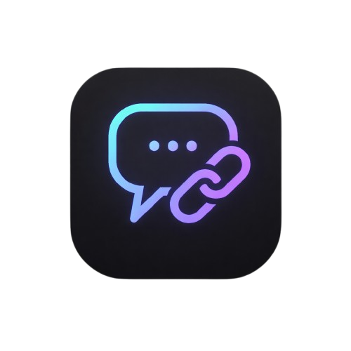

<div align="center">

# CHATIFY - On-Chain Message Board



</div>

---

# Company-Focused Social Messaging Application

A mobile-first blockchain-powered messaging application built with React Native and Expo. Supports private and public chat rooms with immutable, tamper-proof messages stored on blockchain. Features include message editing with full history tracking, company-wide conversations, dual authentication (email or blockchain wallet), and AI-powered features via Google Gemini API.

**Built with:** React Native + Expo | Ethereum Smart Contracts (Remix IDE) | MetaMask Wallet | Gemini AI

## Features

- 🔐 **Dual Authentication**: Login via email or blockchain wallet (MetaMask)
- 💬 **Chat Rooms**: Create and join public, private, or company-specific rooms
- ⛓️ **Blockchain Integration**: All messages are immutable and tamper-proof (deployed via Remix IDE)
- ✏️ **Edit History**: Edit messages while preserving full history on blockchain (like WhatsApp)
- 🤖 **AI-Powered Features**: Message safety analysis, smart suggestions, sentiment detection (Gemini API)
- 🏢 **Company Support**: Dedicated spaces for company-wide communication
- 👥 **Group Conversations**: Support for team and group discussions
- 🔒 **High Security**: End-to-end encrypted private rooms with secure storage
- 🌙 **Modern UI**: Sleek, dark-themed Web3-inspired interface
- 📱 **Mobile-First**: Optimized for mobile devices with smooth navigation
- ⚡ **Expo Go Compatible**: Test instantly using the Expo Go app

## Tech Stack

### Mobile Development
- **React Native** - Cross-platform mobile framework
- **Expo** - Development platform for React Native
- **TypeScript** - Type-safe JavaScript
- **React Navigation** - Native navigation library

### Blockchain & Web3
- **Ethers.js** - Ethereum library for blockchain interactions
- **MetaMask** - Wallet connection for signing transactions
- **Remix IDE** - Browser-based smart contract development and deployment
- **Ethereum Sepolia** - Testnet for development and testing

### AI & Smart Features
- **Google Gemini API** - AI-powered message analysis, suggestions, and sentiment detection

### Data & Storage
- **AsyncStorage** - Secure local storage for credentials
- **Smart Contracts** - On-chain message immutability

## Prerequisites

- Node.js (v16 or higher)
- npm or yarn
- Expo Go app on your mobile device (for testing)

## Installation

1. Clone the repository:
```bash
git clone https://github.com/Krishankant-Dixit/On-Chain_Message_Board-PublicNote-.git
cd On-Chain_Message_Board-PublicNote-
```

2. Install dependencies:
```bash
npm install
```

3. Start the development server:
```bash
npm start
```

4. Scan the QR code with:
   - **iOS**: Camera app
   - **Android**: Expo Go app

## Available Scripts

- `npm start` - Start the Expo development server
- `npm run android` - Run on Android device/emulator
- `npm run ios` - Run on iOS device/simulator (macOS only)
- `npm run web` - Run in web browser

## Project Structure

The project structure is organized as follows:

```
MessageBoard-CHATIFY/
├── app.json
├── App.tsx
├── ARCHITECTURE.md
├── GEMINI_API_SETUP.md
├── index.ts
├── METAMASK_SETUP.md
├── package.json
├── PROJECT_COMPLETION_REPORT.md
├── QUICKSTART.md
├── README.md
├── SETUP.md
├── tsconfig.json
├── assets/
├── src/
│   ├── components/
│   │   ├── AppHeader.tsx
│   │   ├── BackButton.tsx
│   │   ├── Button.tsx
│   │   ├── Card.tsx
│   │   ├── ChatBubble.tsx
│   │   ├── ChatInput.tsx
│   │   ├── index.ts
│   │   ├── Input.tsx
│   │   ├── LoadingScreen.tsx
│   │   ├── MessageCard.tsx
│   │   ├── ProfileAvatar.tsx
│   ├── context/
│   │   ├── AuthContext.tsx
│   │   ├── ThemeContext.tsx
│   │   ├── Web3Context.tsx
│   ├── contracts/
│   │   ├── MessageBoard.ts
│   ├── navigation/
│   │   ├── AppNavigator.tsx
│   ├── screens/
│   │   ├── ChatRoomScreen.tsx
│   │   ├── ChatRoomsScreen.tsx
│   │   ├── ChatScreen.tsx
│   │   ├── CreateRoomScreen.tsx
│   │   ├── HomeScreen_backup.tsx
│   │   ├── HomeScreen.tsx
│   │   ├── index.ts
│   │   ├── LoginScreen.tsx
│   │   ├── PostMessageScreen.tsx
│   │   ├── ProfileScreen.tsx
│   │   ├── SettingsScreen.tsx
│   ├── services/
│   │   ├── geminiService.ts
│   ├── theme/
│   │   ├── colors.ts
│   │   ├── index.ts
│   │   ├── spacing.ts
│   │   ├── theme.ts
│   │   ├── typography.ts
│   ├── utils/
│   │   ├── constants.ts
│   │   ├── helpers.ts
```

## Workflow Chart

The workflow for the application is as follows:

1. User logs in via email or blockchain wallet.
2. User can create or join chat rooms.
3. Messages are sent and stored on the blockchain.
4. Users can edit messages, preserving the edit history.
5. AI features analyze message safety and provide suggestions.
6. Users can engage in company-wide conversations or group discussions.
7. All communications are secured with end-to-end encryption.

**Note:** Ensure to follow the project structure for adding new features or components.

## Setup & Configuration

### 1. Smart Contract Deployment with Remix IDE

Deploy your smart contract without any local setup:

1. Go to [Remix IDE](https://remix.ethereum.org)
2. Create/paste your `MessageBoard.sol` contract
3. Compile with Solidity 0.8.19+
4. Connect MetaMask wallet
5. Deploy to Ethereum Sepolia testnet
6. Copy your contract address

**See [REMIX_IDE_SETUP.md](REMIX_IDE_SETUP.md) for detailed instructions**

### 2. MetaMask Wallet Setup

1. Install [MetaMask](https://metamask.io) browser extension or mobile app
2. Create or import your wallet
3. Add Ethereum Sepolia testnet
4. Get free test ETH from [faucet](https://sepolia-faucet.pk910.de/)

**See [METAMASK_SETUP.md](METAMASK_SETUP.md) for detailed instructions**

### 3. Gemini API Configuration

1. Get your API key from [Google AI Studio](https://aistudio.google.com/app/apikey)
2. Create `.env.local` file in project root:
   ```bash
   EXPO_PUBLIC_GEMINI_API_KEY=your_api_key_here
   EXPO_PUBLIC_RPC_URL=https://sepolia.infura.io/v3/YOUR_KEY
   ```
3. API key is automatically loaded in the app

**See [GEMINI_API_SETUP.md](GEMINI_API_SETUP.md) for detailed instructions**

### 4. Installation & Running

```bash
# 1. Clone and install
git clone https://github.com/Krishankant-Dixit/On-Chain_Message_Board-PublicNote-.git
cd On-Chain_Message_Board-PublicNote-
npm install

# 2. Update configuration
# Edit src/contracts/MessageBoard.ts with your deployed contract address
# Update src/utils/constants.ts with your RPC URL and Gemini key

# 3. Start development server
npm start

# 4. Scan QR code with Expo Go on your phone
```

## Smart Contract Integration

The app is designed to interact with a Message Board smart contract with the following interface:

```solidity
interface IMessageBoard {
    function postMessage(string memory message) external;
    function getMessage(uint256 index) external view returns (string memory, address, uint256);
    function getMessageCount() external view returns (uint256);
}
```

To connect to your deployed contract:
1. Update `MESSAGE_BOARD_ADDRESS` in `src/contracts/MessageBoard.ts`
2. Ensure the ABI matches your deployed contract

## Design System

The app uses a consistent dark Web3-inspired design system:

- **Primary Color**: Indigo (#6366F1)
- **Background**: Dark (#0A0B0D)
- **Accent**: Green (#10B981)
- **Typography**: System fonts with responsive sizing
- **Spacing**: 8px base unit for consistent layout

## Features in Detail

### Authentication
- Dual login methods: Email/Password or Blockchain Wallet
- Persistent session storage with AsyncStorage
- Secure authentication flow with demo mode for testing

### Chat Rooms
- **Public Rooms**: Open for everyone to join and participate
- **Private Rooms**: Invitation-only spaces for confidential discussions
- **Company Rooms**: Dedicated channels for company-wide communication
- Room filtering by type
- Member management and room metadata

### Message Features
- Real-time message sending and receiving
- **Immutable Storage**: All messages stored on blockchain
- **Edit with History**: Update messages while preserving complete edit history
- **Tamper-Proof**: Original content always accessible via blockchain
- Edit indicators and timestamp tracking
- Long-press to view edit history or edit own messages

### Room Management
- Create new rooms with customizable settings
- Set room type (public/private/company)
- Add descriptions and metadata
- Manage room members

### Security & Privacy
- Blockchain-based message immutability
- Secure authentication with persistent storage
- Access control for private rooms
- Edit history permanently recorded on blockchain

## Development

This project uses TypeScript for type safety. Key types and interfaces are defined throughout the codebase.

### Adding New Features

1. Create new components in `src/components/`
2. Add new screens in `src/screens/`
3. Update navigation in `src/navigation/AppNavigator.tsx`
4. Follow the existing theme and design patterns

## Testing with Expo Go

1. Install Expo Go on your device:
   - [iOS App Store](https://apps.apple.com/app/expo-go/id982107779)
   - [Google Play Store](https://play.google.com/store/apps/details?id=host.exp.exponent)

2. Run `npm start` in the project directory

3. Scan the QR code with your device

## Contributing and team

| Name            | Role                          |
|-----------------|-------------------------------|
| [`Ayush`](https://github.com/ayush-code303)     | Web3 & Testing       |
| [`Krishankant Dixit`](https://github.com/krishankantdixit)     | Development and Design       |

## License

MIT License

## Acknowledgments

Built using React Native, Expo, and Web3 technologies.
